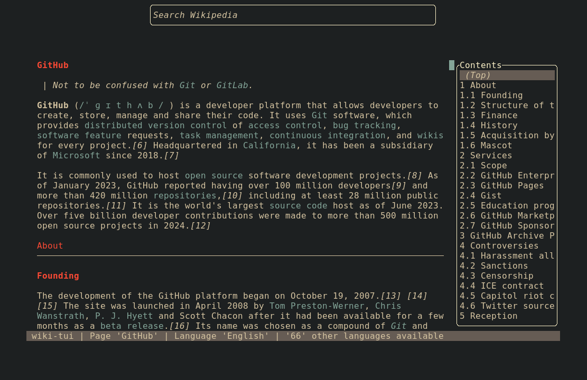
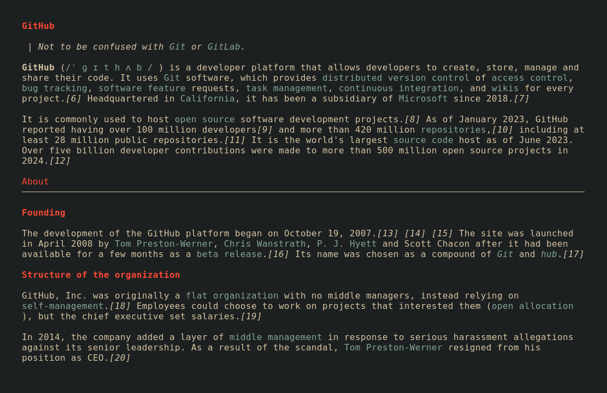

# Page Configuration

In this page you can find all of the configuration options for the page. In the configuration file,
this describes the `[page]` table.

## Padding

[:octicons-tag-24: 0.9.0][release-0.9.0] · :octicons-milestone-16: Default `0`

You can set a padding around the page view (including the table of contents, and the statusbar).
There are different padding options available, each with their own schema of configuring :

* **Uniform**: `page.padding = VAL` Creates a padding with the same values for all sides (left,
    right, top, bottom)
* **Custom**: `page.padding = [VAL, VAL, VAL, VAL]` Creates a padding by specifying every field
    individually. It is `left`, `right`, `top`, `bottom`.
* **Horizontal**: `page.padding.horizontal = VAL` Creates a padding with the same value for left 
    and right
* **Vertical**: `page.padding.vertical = VAL` Creates a padding with the same value for top and
    bottom
* **Proportional**: `page.padding.proportional = VAL` Creates a padding that is visually
    proportional to the terminal. This represents a padding of 2x the value for left and right and 
    1x the value for top and bottom.
* **Symmetric**: `page.padding.symmetric = [VAL, VAL]` Creates a padding that is symmetric. The x 
    value is used for left and right and the y value is used for top and bottom.

> Note: VAL is a u16

## Table of Contents Configuration

### Disabling the Table of Contents

[:octicons-tag-24: 0.5.0][release-0.5.0] · :octicons-milestone-16: Default: `true`

By settings this to false, the table of contents won't be displayed

```toml
page.toc.enabled = false
```

### Changing the Title

[:octicons-tag-24: 0.5.1][release-0.5.1] ·
:octicons-milestone-16: Default: `default`

The available title options for the table of contents are:

* `Default`: uses the title `Contents`
* `Article`: uses the title of the current article
* `Custom`: you can also define a custom title

```toml
page.toc.title = "Default"
```

With a custom title

```toml
page.toc.title = { Custom = "My Custom Title" }
```

### Positioning the Table of Contents

[:octicons-tag-24: 0.5.1][release-0.5.1] ·
:octicons-milestone-16: Default: `Right`
 
Per default, the table of contents is on the right side of the screen. You can also have the table 
of contents be on the left side of the screen

```toml
page.toc.position = "Left"
```

### Adjusting the width

[:octicons-tag-24: 0.9.0][release-0.9.0] · :octicons-milestone-16: Default `20`

You can change the percentage of the space the table of contents will occupy. The values are in
percent (only whole numbers between 0 and 100 are allowed)

```toml
page.toc.width_percentage = 20
```

### Disable Scrolling

[:octicons-tag-24: 0.9.0][release-0.9.0] ·
:octicons-milestone-16: Default: `true`

Will disable scrolling inside of the table of contents if set to `false`

```toml
page.toc.enable_scrolling = true
```

### Modify Item generation

[:octicons-tag-24: 0.5.1][release-0.5.1] ·
:octicons-milestone-16: Default: `{NUMBER} {TEXT}`

If you don't like the look of the items in the table of contents, you can modify how these are generated. Available values are:

* `{NUMBER}`: This is the current number of the header (for example: 1, 1.1, 1.2, 2, ...)
* `{TEXT}`: The text (or content) of the header the item represents

```toml
page.toc.item_format = "{NUMBER} {TEXT}"
```

If you don't like the numbers at the beginning

```toml
page.toc.item_format = "{TEXT}"
```

Or if you want to have a custom beginning

```toml
page.toc.item_format = "# {TEXT}"
```

## Zen Mode

[:octicons-tag-24: 0.9.0][release-0.9.0] · :octicons-milestone-16: Default `""` 

When viewing a page, you can enter `zen-mode` to hide unnecessary and distracting components. To
select which components will be shown even when in `zen-mode`, set the `page.zen_mode.include` 
setting accordingly (The default binding for toggling `zen-mode` is ++f4++). Please note that the 
`zen-mode` setting is individually set for each page, meaning you have to turn it on (again) when 
you're opening a different page.

```toml
page.zen_mode.include = "SCROLLBAR"
```

You can also enable the `zen-mode` by default on a page:

```toml
page.zen_mode.default = false
```

The components currently available to show/hide are:

* `STATUS_BAR`
* `TOC`
* `SEARCH_BAR`
* `SCROLLBAR`

If you want to show multiple components, you can add them together. For example, for showing the 
table of contents and the scrollbar you'd set:

```toml
page.zen_mode.include = "TOC | SCROLLBAR"
```

Alternatively, you can leave out the spaces in between the components:

```toml
page.zen_mode.include  = "TOC|SCROLLBAR"
```

!!! warning
    Do note that these identifiers are case-sensitive, meaning this is not equivalent to the 
    previous (and won't work, because these components don't exist)

    ```toml
    page.zen_mode.include  = "toc | scrollbar"
    ```

    > The exact grammar of the text can be found [here](https://docs.rs/bitflags/2.6.0/bitflags/parser/index.html)

=== "Without Zen-Mode"

    

=== "With Zen-Mode"
    
    

### Changing the size of the content in zen mode

[:octicons-tag-24: 0.9.0][release-0.9.0] · :octicons-milestone-16: Default `80` | `90`

You can change the size of the content in zen mode by setting the horizontal and vertical constraint
of the content. For example, this is the default configuration for the zen mode:

```toml
page.zen_mode.horizontal.percentage = 80
page.zen_mode.vertical.percentage = 90
```

Both of these settings share the same configuration schema. A constraint can have a fixed size or be a
relative constraint.

* **Min**: `page.zen_mode.{horizontal|vertical}.min = u16` 
    Applies a minimum size constraint to the element. The element size is set to at least the 
    specified amount.
* **Max**: `page.zen_mode.{horizontal|vertical}.max = u16`
    Applies a maximum size constraint to the element. The element size is set to at most the 
    specified amount.
* **Length**: `page.zen_mode.{horizontal|vertical}.length = u16`
    Applies a length constraint to the element. The element size is set to the specified amount.
* **Percentage**: `page.zen_mode.{horizontal|vertical}.percentage = u16`
    Applies a percentage of the available space to the element

    Converts the given percentage to a floating-point value and multiplies that with area. This 
    value is rounded back to a integer as part of the layout split calculation.

    !!! note 
        As this value only accepts a u16, certain percentages that cannot be represented exactly 
        (e.g. 1/3) are not possible. You might want to use Ratio in such cases.

* **Ratio**: `page.zen_mode.{horizontal|vertical}.ratio = [u32, u32]`
    Applies a ratio of the available space to the element

    Converts the given ratio to a floating-point value and multiplies that with area. This value 
    is rounded back to a integer as part of the layout split calculation.


[release-0.9.0]: https://github.com/Builditluc/wiki-tui/releases/tag/v0.9
[release-0.5.1]: https://github.com/Builditluc/wiki-tui/releases/tag/v0.5.1
[release-0.5.0]: https://github.com/Builditluc/wiki-tui/releases/tag/v0.5.0
