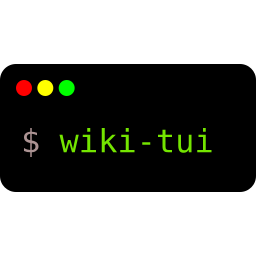
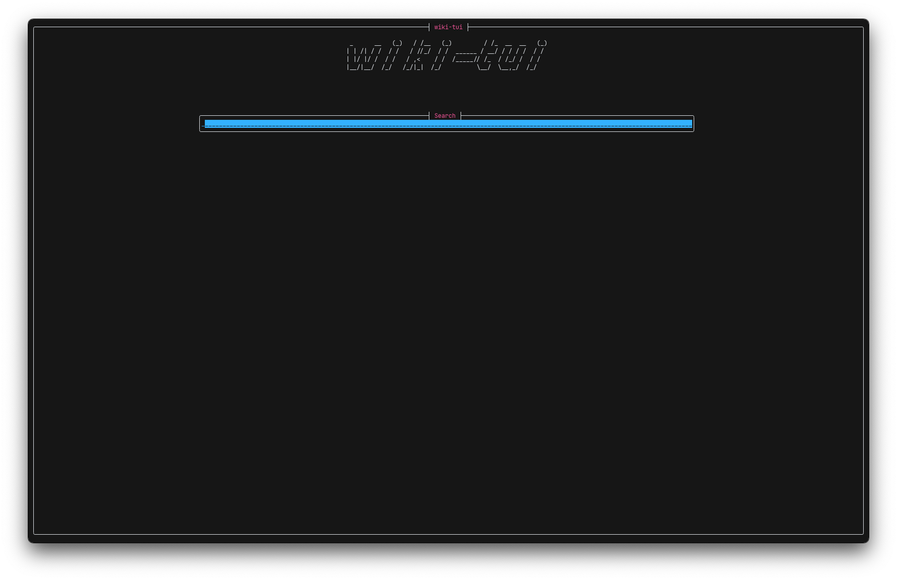
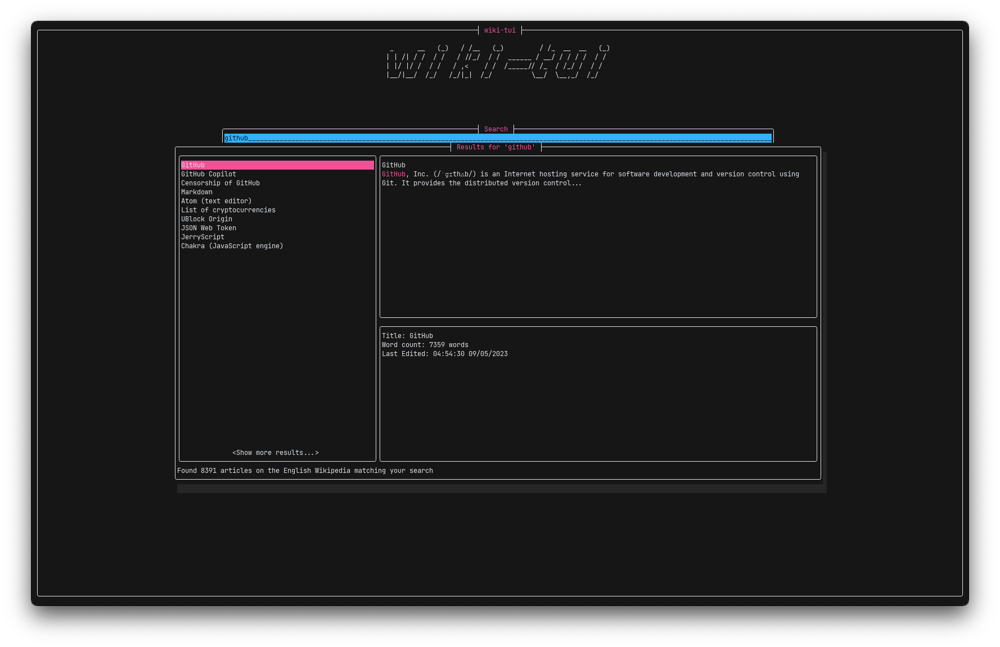
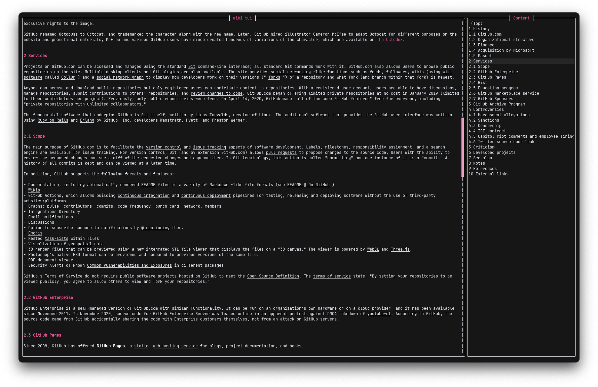

---
hide:
  - title
  - navigation
  - toc
---

#

<figure markdown>

  <figcaption markdown>
**WIKI-TUI**

A simple and easy to use Wikipedia Text User Interface

!!! warning "Active Development"
    wiki-tui is still under active-development (v0.x.x) and that means breaking 
    changes can occur. 

    Please always check the release notes on GitHub before upgrading to a new 
    version!
  </figcaption>
</figure>

# What can it do?

- Browse wikipedia in a TUI. Features of the TUI include:

    - Rich search results (result previews, more information on results,
      continue the current search)
    - Open articles in layers (press ++escape++ to close a layer)
    - A Table of Contents with support for jumping to the section in the
      article
    - Richt article view (functioning links, lists, headers)

- VIM-like Keybindings:
    
    - Basic movement (++h++ / ++j++ / ++k++ / ++l++)
    - Goto Top / Bottom (++"G"++ / ++"gg"++)
    - Half up / down (++ctrl+d++ / ++ctrl+u++)

- It's customizable (we plan on having more features in the future):

    - Change the global and local theme of individual UI components
    - Change some of the keybindings
    - Disable features (Table of Contents, Links)
    - Customize the Table of Contents (position, title format, sizes, etc.)
    - Change wikipedias language (even on the fly)
    - Logging

# How does it look?

??? note "About those Screenshots"
    They were taken on MacOS (iTerm2) with the gruvbox terminal colorscheme. 
    The only configuration change that was done is setting the borders to round
